# 🚀 Guida Completa al Linguaggio C

<div align="center">

[](https://opensource.org/license/mit/)
[](https://en.wikipedia.org/wiki/C_(programming_language))
[](https://www.iso.org/standard/74528.html)
[](https://gcc.gnu.org/)
[](https://github.com)

*Dalla sintassi base alla programmazione avanzata: la guida definitiva per padroneggiare il C*

[Inizia da qui](#-inizia-da-qui) • [Documentazione](#-indice-dei-contenuti) • [Esempi](#-esempi-pratici-completi) • [Contribuisci](#-contribuisci)

</div>

---

## 📖 Introduzione

Il **C** è uno dei linguaggi di programmazione più influenti e longevi della storia dell'informatica. Creato nei primi anni '70 da Dennis Ritchie presso i Bell Labs, rappresenta ancora oggi il fondamento della programmazione di sistema e embedded.

### 🎯 Perché imparare il C?

```mermaid
graph LR
    A[Linguaggio C] --> B[🎯 Performance]
    A --> C[🔧 Controllo Hardware]
    A --> D[🏗️ Fondamento]
    A --> E[💼 Opportunità]
    
    B --> B1[Velocità di esecuzione]
    B --> B2[Efficienza memoria]
    
    C --> C1[Accesso diretto RAM]
    C --> C2[Gestione puntatori]
    C --> C3[Programmazione low-level]
    
    D --> D1[Base per C++, Java, Python]
    D --> D2[Sistemi Operativi]
    D --> D3[Embedded Systems]
    
    E --> E1[IoT & Embedded]
    E --> E2[Game Engines]
    E --> E3[System Programming]
    
    style A fill:#00599C,color:#fff
    style B fill:#4CAF50,color:#fff
    style C fill:#FF9800,color:#fff
    style D fill:#2196F3,color:#fff
    style E fill:#9C27B0,color:#fff
```



### 🌟 Caratteristiche principali

- **⚡ Alte prestazioni**: Codice compilato direttamente in linguaggio macchina
- **🔓 Controllo totale**: Gestione diretta della memoria e delle risorse hardware
- **🌍 Portabilità**: Supporto cross-platform (Linux, Windows, macOS, embedded)
- **📚 Vasta libreria standard**: Strumenti robusti per I/O, stringhe, matematica
- **🏛️ Linguaggio storico**: Utilizzato in Linux, Windows kernel, database, compilatori
- **🎓 Fondamento educativo**: Comprendere il C significa capire come funzionano i computer

### 🏢 Dove viene utilizzato


---

## 🗺️ Indice dei Contenuti

### 🌱 Livello Base
- [Inizia da qui](#-inizia-da-qui)
- [Hello World](#-hello-world---il-tuo-primo-programma)
- [Tipi di dato e variabili](#-tipi-di-dato-e-variabili)
- [Operatori](#-operatori)
- [Controllo di flusso](#-controllo-di-flusso)

### 🌿 Livello Intermedio
- [Array e matrici](#-array-e-matrici)
- [Stringhe](#-stringhe-in-c)
- [Funzioni](#-funzioni)
- [Puntatori](#-puntatori)
- [Header file](#-header-file-e-modularizzazione)

### 🌳 Livello Avanzato
- [Memoria dinamica](#-gestione-memoria-dinamica)
- [File I/O](#-file-io)
- [Struct](#-strutture-struct)
- [Struct complesse](#-struct-complesse-e-gestione-dinamica)
- [Puntatori a funzione](#-puntatori-a-funzione)
- [Preprocessore](#-direttive-del-preprocessore)

### 🎯 Risorse Extra
- [Esempi pratici completi](#-esempi-pratici-completi)
- [Best practices](#-best-practices)
- [Debugging](#-debugging-e-testing)
- [Tool e risorse](#-tool-e-risorse)

---

## 🚀 Inizia da qui

### 📋 Prerequisiti


### 🛠️ Installazione

#### Linux (Ubuntu/Debian)
```bash
sudo apt update
sudo apt install build-essential gcc gdb
gcc --version
```

#### macOS
```bash
xcode-select --install
# oppure con Homebrew
brew install gcc
```

#### Windows
1. Scarica [MinGW-w64](https://www.mingw-w64.org/) o [MSYS2](https://www.msys2.org/)
2. Aggiungi al PATH di sistema
3. Verifica: `gcc --version`

### 📁 Struttura del progetto

```
mio-progetto-c/
│
├── src/                    # File sorgente (.c)
│   ├── main.c
│   └── utils.c
│
├── include/                # Header file (.h)
│   └── utils.h
│
├── build/                  # File compilati
│   └── main
│
├── docs/                   # Documentazione
│   └── README.md
│
└── Makefile               # Script di build
```

---

## 💡 Hello World - Il tuo primo programma

```c
#include <stdio.h>  // Libreria standard per input/output

/**
 * Funzione principale - punto di ingresso del programma
 * @return 0 indica successo, altri valori indicano errori
 */
int main() {
    printf("Hello, World!\n");  // Stampa su console
    return 0;                   // Termina con successo
}
```

### 🔧 Compilazione ed esecuzione

```bash
# Compilazione base
gcc hello.c -o hello

# Esecuzione
./hello

# Compilazione con warning dettagliati (RACCOMANDATO)
gcc -Wall -Wextra -Wpedantic -std=c11 hello.c -o hello

# Compilazione con debug info
gcc -g -Wall hello.c -o hello

# Ottimizzazione per performance
gcc -O2 hello.c -o hello
```

### 📊 Flusso di compilazione


---

## 🔡 Tipi di dato e variabili

### 📊 Tipi primitivi


### 💻 Esempi pratici

```c
#include <stdio.h>
#include <stdbool.h>  // Per bool, true, false

int main() {
    // Interi
    int numero = 42;
    unsigned int positivo = 100;     // Solo valori >= 0
    long long grande = 9876543210LL;
    
    // Floating point
    float temperatura = 21.5f;       // f indica float
    double pi = 3.14159265359;
    
    // Caratteri
    char lettera = 'A';
    char newline = '\n';
    
    // Booleani (C99+)
    bool attivo = true;
    bool completato = false;
    
    // Costanti
    const int MAX = 100;
    
    // Stampa dimensioni
    printf("int: %zu byte\n", sizeof(int));
    printf("double: %zu byte\n", sizeof(double));
    printf("char: %zu byte\n", sizeof(char));
    
    return 0;
}
```

### 🎨 Modificatori e qualificatori

| Modificatore | Descrizione | Esempio |
|--------------|-------------|---------|
| `unsigned` | Solo valori positivi | `unsigned int x = 100;` |
| `signed` | Valori positivi e negativi (default) | `signed int y = -50;` |
| `short` | Versione più piccola | `short int s = 32000;` |
| `long` | Versione più grande | `long int l = 2147483648L;` |
| `const` | Valore immutabile | `const float PI = 3.14f;` |
| `volatile` | Valore può cambiare esternamente | `volatile int sensor;` |

---

## ➕ Operatori

### 🔢 Classificazione completa

```c
// ============ ARITMETICI ============
int a = 10, b = 3;
int somma = a + b;        // 13
int diff = a - b;         // 7
int prod = a * b;         // 30
int div = a / b;          // 3 (divisione intera!)
int resto = a % b;        // 1 (modulo)

a++;  // incremento: a = 11
b--;  // decremento: b = 2

// ============ RELAZIONALI ============
bool uguale = (a == b);      // false
bool diverso = (a != b);     // true
bool maggiore = (a > b);     // true
bool minore = (a < b);       // false
bool maggiore_uguale = (a >= b);
bool minore_uguale = (a <= b);

// ============ LOGICI ============
bool and_logico = (a > 5 && b < 10);   // true AND true = true
bool or_logico = (a < 5 || b > 10);    // false OR false = false
bool not_logico = !(a > 5);             // NOT true = false

// ============ BITWISE ============
int x = 5;   // 0101 in binario
int y = 3;   // 0011 in binario

int and_bit = x & y;    // 0001 = 1
int or_bit = x | y;     // 0111 = 7
int xor_bit = x ^ y;    // 0110 = 6
int not_bit = ~x;       // inverte tutti i bit
int shift_left = x << 1;  // 1010 = 10
int shift_right = x >> 1; // 0010 = 2

// ============ ASSEGNAMENTO ============
int z = 10;
z += 5;   // z = z + 5  -> 15
z -= 3;   // z = z - 3  -> 12
z *= 2;   // z = z * 2  -> 24
z /= 4;   // z = z / 4  -> 6
z %= 5;   // z = z % 5  -> 1

// ============ TERNARIO ============
int max = (a > b) ? a : b;  // se a > b allora a, altrimenti b
```

### 📊 Precedenza degli operatori

```mermaid
graph TD
    A[Precedenza Operatori<br/>dall'alto al basso] --> B[1. Postfissi: x++ x--]
    B --> C[2. Unari: ++x --x !x ~x]
    C --> D[3. Moltiplicativi: * / %]
    D --> E[4. Additivi: + -]
    E --> F[5. Shift: << >>]
    F --> G[6. Relazionali: < > <= >=]
    G --> H[7. Uguaglianza: == !=]
    H --> I[8. Bitwise AND: &]
    I --> J[9. Bitwise XOR: ^]
    J --> K[10. Bitwise OR: |]
    K --> L[11. Logico AND: &&]
    L --> M[12. Logico OR: ||]
    M --> N[13. Ternario: ? :]
    N --> O[14. Assegnamento: = += -=]
    
    style A fill:#00599C,color:#fff
    style D fill:#4CAF50,color:#fff
    style E fill:#4CAF50,color:#fff
    style L fill:#FF9800,color:#fff
    style M fill:#FF9800,color:#fff
```

---

## 🔁 Controllo di flusso

### 🎯 Strutture condizionali

```c
// ============ IF-ELSE ============
int voto = 85;

if (voto >= 90) {
    printf("Eccellente!\n");
} else if (voto >= 70) {
    printf("Buono!\n");
} else if (voto >= 60) {
    printf("Sufficiente\n");
} else {
    printf("Insufficiente\n");
}

// ============ SWITCH-CASE ============
char operatore = '+';
int x = 10, y = 5, risultato;

switch(operatore) {
    case '+':
        risultato = x + y;
        break;  // IMPORTANTE: senza break continua al prossimo case!
    case '-':
        risultato = x - y;
        break;
    case '*':
        risultato = x * y;
        break;
    case '/':
        if (y != 0) {
            risultato = x / y;
        } else {
            printf("Errore: divisione per zero!\n");
            return 1;
        }
        break;
    default:
        printf("Operatore non riconosciuto\n");
        return 1;
}

printf("Risultato: %d\n", risultato);
```

### 🔄 Cicli (Loops)

```c
// ============ FOR LOOP ============
// Sintassi: for (inizializzazione; condizione; aggiornamento)
for (int i = 0; i < 5; i++) {
    printf("%d ", i);  // Output: 0 1 2 3 4
}

// Loop inverso
for (int i = 10; i >= 0; i--) {
    printf("%d ", i);  // Countdown da 10 a 0
}

// ============ WHILE LOOP ============
int contatore = 0;
while (contatore < 5) {
    printf("%d ", contatore);
    contatore++;
}

// ============ DO-WHILE LOOP ============
int scelta;
do {
    printf("Menu:\n1. Opzione A\n2. Opzione B\n0. Esci\n");
    printf("Scelta: ");
    scanf("%d", &scelta);
    
    switch(scelta) {
        case 1: printf("Hai scelto A\n"); break;
        case 2: printf("Hai scelto B\n"); break;
        case 0: printf("Uscita...\n"); break;
        default: printf("Scelta non valida\n");
    }
} while (scelta != 0);  // Esegue almeno una volta

// ============ BREAK E CONTINUE ============
for (int i = 0; i < 10; i++) {
    if (i == 5) {
        break;  // Esce completamente dal ciclo
    }
    if (i % 2 == 0) {
        continue;  // Salta all'iterazione successiva
    }
    printf("%d ", i);  // Stampa solo numeri dispari < 5
}
```

### 📊 Diagramma di flusso

```mermaid
flowchart TD
    Start([Inizio]) --> Input[/Input voto/]
    Input --> Check1{voto >= 90?}
    Check1 -->|Sì| Output1[Eccellente]
    Check1 -->|No| Check2{voto >= 70?}
    Check2 -->|Sì| Output2[Buono]
    Check2 -->|No| Check3{voto >= 60?}
    Check3 -->|Sì| Output3[Sufficiente]
    Check3 -->|No| Output4[Insufficiente]
    Output1 --> End([Fine])
    Output2 --> End
    Output3 --> End
    Output4 --> End
    
    style Start fill:#4CAF50,color:#fff
    style End fill:#F44336,color:#fff
    style Check1 fill:#FF9800,color:#fff
    style Check2 fill:#FF9800,color:#fff
    style Check3 fill:#FF9800,color:#fff
```



---

## 📚 Array e matrici

### 🎯 Array monodimensionali

```c
#include <stdio.h>

int main() {
    // Dichiarazione e inizializzazione
    int numeri[5] = {10, 20, 30, 40, 50};
    
    // Accesso agli elementi (indice parte da 0)
    printf("Primo elemento: %d\n", numeri[0]);  // 10
    printf("Ultimo elemento: %d\n", numeri[4]); // 50
    
    // Modifica elementi
    numeri[2] = 35;
    
    // Iterazione
    for (int i = 0; i < 5; i++) {
        printf("numeri[%d] = %d\n", i, numeri[i]);
    }
    
    // Dimensione array
    int dimensione = sizeof(numeri) / sizeof(numeri[0]);
    printf("L'array contiene %d elementi\n", dimensione);
    
    // Array parzialmente inizializzato
    int zeros[10] = {0};  // Tutti gli elementi = 0
    
    // Array senza dimensione esplicita
    int valori[] = {1, 2, 3, 4, 5};  // Dimensione dedotta: 5
    
    return 0;
}
```

### 🔢 Array multidimensionali (Matrici)

```c
#include <stdio.h>

int main() {
    // Matrice 3x3
    int matrice[3][3] = {
        {1, 2, 3},
        {4, 5, 6},
        {7, 8, 9}
    };
    
    // Accesso elementi
    printf("Elemento [1][2]: %d\n", matrice[1][2]);  // 6
    
    // Iterazione su matrice
    printf("Matrice completa:\n");
    for (int i = 0; i < 3; i++) {
        for (int j = 0; j < 3; j++) {
            printf("%d ", matrice[i][j]);
        }
        printf("\n");
    }
    
    // Somma elementi
    int somma = 0;
    for (int i = 0; i < 3; i++) {
        for (int j = 0; j < 3; j++) {
            somma += matrice[i][j];
        }
    }
    printf("Somma totale: %d\n", somma);
    
    return 0;
}
```

### 📊 Visualizzazione memoria array


---

## 🔤 Stringhe in C

```c
#include <stdio.h>
#include <string.h>

int main() {
    // Le stringhe sono array di char terminati da '\0'
    char nome[50] = "Mario";
    char cognome[] = "Rossi";  // Dimensione automatica
    
    // Carattere terminatore
    // "Mario" in memoria: 'M' 'a' 'r' 'i' 'o' '\0'
    
    printf("Nome: %s\n", nome);
    printf("Lunghezza: %zu\n", strlen(nome));  // 5
    
    // Copia stringhe
    char copia[50];
    strcpy(copia, nome);
    
    // Concatenazione
    char completo[100] = "Mario";
    strcat(completo, " ");
    strcat(completo, "Rossi");  // "Mario Rossi"
    
    // Confronto stringhe
    if (strcmp(nome, "Mario") == 0) {
        printf("Nome corretto!\n");
    }
    
    // Input stringa
    char input[100];
    printf("Inserisci testo: ");
    fgets(input, sizeof(input), stdin);  // SICURO
    // scanf("%s", input);  // EVITARE: non sicuro
    
    return 0;
}
```

---

## 🧭 Funzioni

### 📝 Sintassi e struttura

```c
#include <stdio.h>

// Dichiarazione (prototipo)
int somma(int a, int b);
void saluta(const char *nome);
double media(int arr[], int dimensione);

int main() {
    int risultato = somma(5, 3);
    printf("5 + 3 = %d\n", risultato);
    
    saluta("Mario");
    
    int voti[] = {28, 30, 27, 29};
    double m = media(voti, 4);
    printf("Media: %.2f\n", m);
    
    return 0;
}

// Definizione funzioni
int somma(int a, int b) {
    return a + b;
}

void saluta(const char *nome) {
    printf("Ciao, %s!\n", nome);
}

double media(int arr[], int dimensione) {
    int somma = 0;
    for (int i = 0; i < dimensione; i++) {
        somma += arr[i];
    }
    return (double)somma / dimensione;
}
```

### 🔄 Passaggio parametri


```c
// Passaggio per valore
void incrementa_valore(int x) {
    x++;  // Modifica solo la copia locale
}

// Passaggio per riferimento (puntatore)
void incrementa_riferimento(int *x) {
    (*x)++;  // Modifica il valore originale
}

int main() {
    int num = 10;
    
    incrementa_valore(num);
    printf("%d\n", num);  // 10 (invariato)
    
    incrementa_riferimento(&num);
    printf("%d\n", num);  // 11 (modificato)
    
    return 0;
}
```

---

## 📌 Puntatori

### 🎯 Concetti fondamentali


### 💻 Sintassi e operazioni

```c
#include <stdio.h>

int main() {
    // ============ BASE ============
    int x = 42;
    int *p = &x;  // p contiene l'indirizzo di x
    
    printf("Valore di x: %d\n", x);           // 42
    printf("Indirizzo di x: %p\n", (void*)&x); // es: 0x7ffc123
    printf("Valore di p: %p\n", (void*)p);    // stesso indirizzo
    printf("Valore puntato: %d\n", *p);       // 42 (dereferenziazione)
    
    // ============ MODIFICA ============
    *p = 100;  // Modifica x attraverso il puntatore
    printf("Nuovo valore di x: %d\n", x);  // 100
    
    // ============ PUNTATORI E ARRAY ============
    int arr[] = {10, 20, 30, 40, 50};
    int *ptr = arr;  // Il nome dell'array è già un puntatore
    
    printf("Primo elemento: %d\n", *ptr);      // 10
    printf("Secondo elemento: %d\n", *(ptr+1)); // 20
    printf("Terzo elemento: %d\n", ptr[2]);     // 30 (notazione array)
    
    // Iterazione con puntatori
    for (int i = 0; i < 5; i++) {
        printf("%d ", *(ptr + i));
    }
    printf("\n");
    
    // ============ ARITMETICA DEI PUNTATORI ============
    int *inizio = arr;
    int *fine = arr + 4;  // Punta all'ultimo elemento
    
    printf("Differenza: %ld elementi\n", fine - inizio);  // 4
    
    // ============ PUNTATORI NULLI ============
    int *null_ptr = NULL;  // Puntatore che non punta a nulla
    
    if (null_ptr == NULL) {
        printf("Puntatore non inizializzato\n");
    }
    
    // ============ PUNTATORI A PUNTATORI ============
    int valore = 100;
    int *p1 = &valore;
    int **p2 = &p1;  // Puntatore a puntatore
    
    printf("Valore: %d\n", **p2);  // 100 (doppia dereferenziazione)
    
    return 0;
}
⚠️ Errori comuni con i puntatori
c// ❌ ERRORE 1: Puntatore non inizializzato
int *p;
*p = 10;  // CRASH! p punta a un indirizzo casuale

// ✅ CORRETTO
int *p = NULL;
int x = 10;
p = &x;
*p = 20;

// ❌ ERRORE 2: Dereferenziare NULL
int *p = NULL;
printf("%d", *p);  // CRASH!

// ✅ CORRETTO
if (p != NULL) {
    printf("%d", *p);
}

// ❌ ERRORE 3: Perdere il riferimento
int *p = malloc(100);
p = NULL;  // Memoria allocata persa (memory leak)

// ✅ CORRETTO
int *p = malloc(100);
free(p);
p = NULL;
📊 Visualizzazione memoria puntatori
mermaidgraph TB
    subgraph "Stack"
        A[x = 42<br/>0x1000]
        B[p = 0x1000<br/>0x2000]
    end
    
    B -.->|punta a| A
    
    style A fill:#4CAF50,color:#fff
    style B fill:#2196F3,color:#fff

🧱 Gestione Memoria Dinamica
🎯 Funzioni principali
c#include <stdio.h>
#include <stdlib.h>
#include <string.h>

int main() {
    // ============ MALLOC ============
    // Alloca memoria non inizializzata
    int *numeri = (int*)malloc(5 * sizeof(int));
    
    if (numeri == NULL) {
        fprintf(stderr, "Errore allocazione memoria\n");
        return 1;
    }
    
    // Uso della memoria
    for (int i = 0; i < 5; i++) {
        numeri[i] = i * 10;
    }
    
    // ============ CALLOC ============
    // Alloca memoria inizializzata a zero
    int *zeros = (int*)calloc(10, sizeof(int));
    
    if (zeros == NULL) {
        free(numeri);
        return 1;
    }
    
    // ============ REALLOC ============
    // Ridimensiona memoria già allocata
    int *temp = (int*)realloc(numeri, 10 * sizeof(int));
    
    if (temp == NULL) {
        // realloc fallito, numeri è ancora valido
        free(numeri);
        free(zeros);
        return 1;
    }
    
    numeri = temp;  // Aggiorna il puntatore
    
    // Inizializza nuovi elementi
    for (int i = 5; i < 10; i++) {
        numeri[i] = i * 10;
    }
    
    // ============ FREE ============
    // Libera la memoria allocata
    free(numeri);
    free(zeros);
    numeri = NULL;  // Buona pratica
    zeros = NULL;
    
    return 0;
}
🔄 Ciclo di vita memoria dinamica
mermaidsequenceDiagram
    participant P as Programma
    participant H as Heap
    
    P->>H: malloc(size)
    H-->>P: puntatore memoria
    Note over P: Usa la memoria
    P->>P: operazioni sui dati
    Note over P: Quando non serve più
    P->>H: free(ptr)
    H-->>P: memoria liberata
    P->>P: ptr = NULL
    
    Note over P,H: ⚠️ Senza free() = Memory Leak!
💡 Esempio pratico: Array dinamico
c#include <stdio.h>
#include <stdlib.h>

typedef struct {
    int *data;
    int size;
    int capacity;
} DynamicArray;

DynamicArray* create_array(int initial_capacity) {
    DynamicArray *arr = (DynamicArray*)malloc(sizeof(DynamicArray));
    if (arr == NULL) return NULL;
    
    arr->data = (int*)malloc(initial_capacity * sizeof(int));
    if (arr->data == NULL) {
        free(arr);
        return NULL;
    }
    
    arr->size = 0;
    arr->capacity = initial_capacity;
    return arr;
}

void push(DynamicArray *arr, int value) {
    if (arr->size >= arr->capacity) {
        // Raddoppia la capacità
        int new_capacity = arr->capacity * 2;
        int *new_data = (int*)realloc(arr->data, new_capacity * sizeof(int));
        
        if (new_data == NULL) {
            fprintf(stderr, "Errore: impossibile espandere array\n");
            return;
        }
        
        arr->data = new_data;
        arr->capacity = new_capacity;
    }
    
    arr->data[arr->size++] = value;
}

void destroy_array(DynamicArray *arr) {
    if (arr != NULL) {
        free(arr->data);
        free(arr);
    }
}

int main() {
    DynamicArray *arr = create_array(4);
    
    if (arr == NULL) {
        fprintf(stderr, "Errore creazione array\n");
        return 1;
    }
    
    // Aggiungi elementi
    for (int i = 0; i < 10; i++) {
        push(arr, i * 10);
        printf("Size: %d, Capacity: %d\n", arr->size, arr->capacity);
    }
    
    // Stampa elementi
    for (int i = 0; i < arr->size; i++) {
        printf("%d ", arr->data[i]);
    }
    printf("\n");
    
    destroy_array(arr);
    return 0;
}

📄 File I/O
📖 Operazioni base
c#include <stdio.h>
#include <stdlib.h>

int main() {
    FILE *file;
    
    // ============ SCRITTURA ============
    file = fopen("output.txt", "w");  // "w" = write (sovrascrive)
    
    if (file == NULL) {
        perror("Errore apertura file");
        return 1;
    }
    
    fprintf(file, "Prima riga\n");
    fprintf(file, "Numero: %d\n", 42);
    fputs("Terza riga\n", file);
    
    fclose(file);
    
    // ============ APPEND ============
    file = fopen("output.txt", "a");  // "a" = append
    fprintf(file, "Riga aggiunta\n");
    fclose(file);
    
    // ============ LETTURA ============
    file = fopen("output.txt", "r");  // "r" = read
    
    if (file == NULL) {
        perror("Errore apertura file");
        return 1;
    }
    
    char buffer[256];
    
    // Leggi riga per riga
    while (fgets(buffer, sizeof(buffer), file) != NULL) {
        printf("%s", buffer);
    }
    
    fclose(file);
    
    return 0;
}
🔧 Modalità di apertura file
ModalitàDescrizioneCreaLeggeScriveSovrascrive"r"Read❌✅❌❌"w"Write✅❌✅✅"a"Append✅❌✅❌"r+"Read/Write❌✅✅❌"w+"Write/Read✅✅✅✅"a+"Append/Read✅✅✅❌
💾 File binari
c#include <stdio.h>

typedef struct {
    int id;
    char nome[50];
    float stipendio;
} Dipendente;

int main() {
    // ============ SCRITTURA BINARIA ============
    FILE *file = fopen("dipendenti.dat", "wb");  // "b" = binary
    
    if (file == NULL) {
        perror("Errore apertura file");
        return 1;
    }
    
    Dipendente dip1 = {1, "Mario Rossi", 2500.50};
    Dipendente dip2 = {2, "Laura Bianchi", 2800.00};
    
    fwrite(&dip1, sizeof(Dipendente), 1, file);
    fwrite(&dip2, sizeof(Dipendente), 1, file);
    
    fclose(file);
    
    // ============ LETTURA BINARIA ============
    file = fopen("dipendenti.dat", "rb");
    
    if (file == NULL) {
        perror("Errore apertura file");
        return 1;
    }
    
    Dipendente dip;
    
    while (fread(&dip, sizeof(Dipendente), 1, file) == 1) {
        printf("ID: %d, Nome: %s, Stipendio: %.2f\n",
               dip.id, dip.nome, dip.stipendio);
    }
    
    fclose(file);
    
    return 0;
}

🏗️ Strutture (Struct)
📦 Definizione e utilizzo
c#include <stdio.h>
#include <string.h>

// ============ DEFINIZIONE STRUCT ============
struct Persona {
    char nome[50];
    char cognome[50];
    int eta;
    float altezza;
};

// Typedef per sintassi più pulita
typedef struct {
    int x;
    int y;
} Punto;

typedef struct {
    char marca[30];
    char modello[30];
    int anno;
    float prezzo;
} Auto;

int main() {
    // ============ DICHIARAZIONE E INIZIALIZZAZIONE ============
    struct Persona persona1;
    strcpy(persona1.nome, "Mario");
    strcpy(persona1.cognome, "Rossi");
    persona1.eta = 30;
    persona1.altezza = 1.75;
    
    // Inizializzazione diretta
    Punto p1 = {10, 20};
    
    // Inizializzazione con nomi campi (C99+)
    Auto macchina = {
        .marca = "Fiat",
        .modello = "Panda",
        .anno = 2020,
        .prezzo = 12000.00
    };
    
    // ============ ACCESSO AI CAMPI ============
    printf("Nome: %s %s\n", persona1.nome, persona1.cognome);
    printf("Età: %d anni\n", persona1.eta);
    printf("Altezza: %.2f m\n", persona1.altezza);
    
    printf("\nPunto: (%d, %d)\n", p1.x, p1.y);
    
    printf("\nAuto: %s %s (%d) - €%.2f\n",
           macchina.marca, macchina.modello,
           macchina.anno, macchina.prezzo);
    
    // ============ ARRAY DI STRUCT ============
    Punto punti[3] = {
        {0, 0},
        {10, 10},
        {20, 20}
    };
    
    for (int i = 0; i < 3; i++) {
        printf("Punto %d: (%d, %d)\n", i, punti[i].x, punti[i].y);
    }
    
    return 0;
}
🔗 Struct complesse e gestione dinamica
c#include <stdio.h>
#include <stdlib.h>
#include <string.h>

// ============ STRUCT ANNIDATA ============
typedef struct {
    char via[100];
    char citta[50];
    int cap;
} Indirizzo;

typedef struct {
    char nome[50];
    int eta;
    Indirizzo residenza;  // Struct dentro struct
} Persona;

// ============ STRUCT CON PUNTATORI ============
typedef struct Nodo {
    int valore;
    struct Nodo *next;  // Puntatore al prossimo nodo
} Nodo;

// ============ FUNZIONI PER STRUCT ============
Persona* crea_persona(const char *nome, int eta) {
    Persona *p = (Persona*)malloc(sizeof(Persona));
    if (p == NULL) return NULL;
    
    strcpy(p->nome, nome);  // Usa -> con puntatori a struct
    p->eta = eta;
    strcpy(p->residenza.via, "Via Roma 1");
    strcpy(p->residenza.citta, "Milano");
    p->residenza.cap = 20100;
    
    return p;
}

void stampa_persona(const Persona *p) {
    printf("Nome: %s\n", p->nome);
    printf("Età: %d\n", p->eta);
    printf("Indirizzo: %s, %s (%d)\n",
           p->residenza.via,
           p->residenza.citta,
           p->residenza.cap);
}

// ============ LISTA CONCATENATA ============
void push(Nodo **testa, int valore) {
    Nodo *nuovo = (Nodo*)malloc(sizeof(Nodo));
    if (nuovo == NULL) return;
    
    nuovo->valore = valore;
    nuovo->next = *testa;
    *testa = nuovo;
}

void stampa_lista(Nodo *testa) {
    Nodo *corrente = testa;
    while (corrente != NULL) {
        printf("%d -> ", corrente->valore);
        corrente = corrente->next;
    }
    printf("NULL\n");
}

void libera_lista(Nodo *testa) {
    Nodo *temp;
    while (testa != NULL) {
        temp = testa;
        testa = testa->next;
        free(temp);
    }
}

int main() {
    // ============ USO PERSONA ============
    Persona *p1 = crea_persona("Mario Rossi", 30);
    if (p1 != NULL) {
        stampa_persona(p1);
        free(p1);
    }
    
    printf("\n");
    
    // ============ USO LISTA ============
    Nodo *lista = NULL;
    
    push(&lista, 30);
    push(&lista, 20);
    push(&lista, 10);
    
    stampa_lista(lista);  // 10 -> 20 -> 30 -> NULL
    
    libera_lista(lista);
    
    return 0;
}
📊 Memoria struct
mermaidgraph TB
    subgraph "Struct Persona in memoria"
        A[nome: char[50]<br/>50 byte]
        B[eta: int<br/>4 byte]
        C[residenza.via: char[100]<br/>100 byte]
        D[residenza.citta: char[50]<br/>50 byte]
        E[residenza.cap: int<br/>4 byte]
    end
    
    A --> B --> C --> D --> E
    
    F[sizeof Persona] -.-> G[≈ 208 byte<br/>può includere padding]
    
    style A fill:#E3F2FD
    style B fill:#BBDEFB
    style C fill:#90CAF9
    style D fill:#64B5F6
    style E fill:#42A5F5,color:#fff
    style F fill:#00599C,color:#fff
    style G fill:#4CAF50,color:#fff

🎯 Puntatori a funzione
c#include <stdio.h>

// ============ FUNZIONI BASE ============
int somma(int a, int b) {
    return a + b;
}

int sottrazione(int a, int b) {
    return a - b;
}

int moltiplicazione(int a, int b) {
    return a * b;
}

// ============ FUNZIONE CHE USA PUNTATORI A FUNZIONE ============
int applica_operazione(int x, int y, int (*operazione)(int, int)) {
    return operazione(x, y);
}

// ============ TYPEDEF PER PUNTATORI A FUNZIONE ============
typedef int (*OperazioneBinaria)(int, int);

void esegui_operazioni(int a, int b, OperazioneBinaria ops[], int n_ops) {
    for (int i = 0; i < n_ops; i++) {
        printf("Risultato operazione %d: %d\n", i, ops[i](a, b));
    }
}

// ============ CALLBACK ============
void processa_array(int arr[], int size, void (*callback)(int)) {
    for (int i = 0; i < size; i++) {
        callback(arr[i]);
    }
}

void stampa_numero(int n) {
    printf("%d ", n);
}

void stampa_quadrato(int n) {
    printf("%d ", n * n);
}

int main() {
    // ============ PUNTATORE A FUNZIONE BASE ============
    int (*ptr_funzione)(int, int);
    
    ptr_funzione = somma;
    printf("Somma: %d\n", ptr_funzione(5, 3));  // 8
    
    ptr_funzione = sottrazione;
    printf("Sottrazione: %d\n", ptr_funzione(5, 3));  // 2
    
    // ============ PASSAGGIO A FUNZIONE ============
    int risultato = applica_operazione(10, 5, moltiplicazione);
    printf("Moltiplicazione: %d\n", risultato);  // 50
    
    // ============ ARRAY DI PUNTATORI A FUNZIONE ============
    OperazioneBinaria operazioni[] = {
        somma,
        sottrazione,
        moltiplicazione
    };
    
    esegui_operazioni(10, 5, operazioni, 3);
    
    // ============ CALLBACK ============
    int numeri[] = {1, 2, 3, 4, 5};
    
    printf("\nNumeri: ");
    processa_array(numeri, 5, stampa_numero);
    
    printf("\nQuadrati: ");
    processa_array(numeri, 5, stampa_quadrato);
    
    printf("\n");
    
    return 0;
}

🔧 Direttive del Preprocessore
c// ============ INCLUDE ============
#include <stdio.h>      // Librerie standard
#include "mio_header.h" // Header personali

// ============ DEFINE ============
#define PI 3.14159
#define MAX_SIZE 100
#define SQUARE(x) ((x) * (x))  // Macro con parametri

// Uso parentesi nelle macro!
#define BAD_SQUARE(x) x * x     // ❌ ERRORE con BAD_SQUARE(2+3)
#define GOOD_SQUARE(x) ((x) * (x))  // ✅ CORRETTO

// ============ CONDITIONAL COMPILATION ============
#define DEBUG 1

#ifdef DEBUG
    #define DEBUG_PRINT(fmt, ...) printf(fmt, ##__VA_ARGS__)
#else
    #define DEBUG_PRINT(fmt, ...)
#endif

// ============ INCLUDE GUARD ============
// Nel file .h
#ifndef MIO_HEADER_H
#define MIO_HEADER_H

// Codice header...

#endif // MIO_HEADER_H

// ============ PRAGMA ============
#pragma once  // Alternativa moderna all'include guard

// ============ PREDEFINED MACROS ============
int main() {
    printf("File: %s\n", __FILE__);
    printf("Linea: %d\n", __LINE__);
    printf("Data: %s\n", __DATE__);
    printf("Ora: %s\n", __TIME__);
    
    #ifdef DEBUG
        DEBUG_PRINT("Modalità debug attiva\n");
    #endif
    
    int x = 5;
    printf("Quadrato di %d: %d\n", x, SQUARE(x));
    
    return 0;
}
```

---

## 📁 Header file e modularizzazione

### 🗂️ Struttura progetto
```
progetto/
│
├── include/
│   ├── math_utils.h
│   └── string_utils.h
│
├── src/
│   ├── main.c
│   ├── math_utils.c
│   └── string_utils.c
│
└── Makefile
📄 Esempio: math_utils.h
c#ifndef MATH_UTILS_H
#define MATH_UTILS_H

// Costanti
#define PI 3.14159265359

// Prototipi funzioni
int somma(int a, int b);
int sottrazione(int a, int b);
double media(int arr[], int size);
int massimo(int arr[], int size);
int minimo(int arr[], int size);

#endif // MATH_UTILS_H
📄 Esempio: math_utils.c
c#include "math_utils.h"
#include <limits.h>

int somma(int a, int b) {
    return a + b;
}

int sottrazione(int a, int b) {
    return a - b;
}

double media(int arr[], int size) {
    if (size == 0) return 0.0;
    
    int somma = 0;
    for (int i = 0; i < size; i++) {
        somma += arr[i];
    }
    
    return (double)somma / size;
}

int massimo(int arr[], int size) {
    if (size == 0) return INT_MIN;
    
    int max = arr[0];
    for (int i = 1; i < size; i++) {
        if (arr[i] > max) {
            max = arr[i];
        }
    }
    
    return max;
}

int minimo(int arr[], int size) {
    if (size == 0) return INT_MAX;
    
    int min = arr[0];
    for (int i = 1; i < size; i++) {
        if (arr[i] < min) {
            min = arr[i];
        }
    }
    
    return min;
}
📄 Esempio: main.c
c#include <stdio.h>
#include "math_utils.h"

int main() {
    int numeri[] = {45, 23, 67, 12, 89, 34};
    int size = sizeof(numeri) / sizeof(numeri[0]);
    
    printf("Array: ");
    for (int i = 0; i < size; i++) {
        printf("%d ", numeri[i]);
    }
    printf("\n");
    
    printf("Somma 10 + 20: %d\n", somma(10, 20));
    printf("Media: %.2f\n", media(numeri, size));
    printf("Massimo: %d\n", massimo(numeri, size));
    printf("Minimo: %d\n", minimo(numeri, size));
    printf("PI: %.5f\n", PI);
    
    return 0;
}
🔨 Makefile
makefileCC = gcc
CFLAGS = -Wall -Wextra -Wpedantic -std=c11 -Iinclude
TARGET = programma

SRCS = src/main.c src/math_utils.c
OBJS = $(SRCS:.c=.o)

all: $(TARGET)

$(TARGET): $(OBJS)
	$(CC) $(CFLAGS) -o $@ $^

%.o: %.c
	$(CC) $(CFLAGS) -c $< -o $@

clean:
	rm -f $(OBJS) $(TARGET)

run: $(TARGET)
	./$(TARGET)

.PHONY: all clean run

🎓 Esempi Pratici Completi
📊 Esempio 1: Gestione studenti
c#include <stdio.h>
#include <stdlib.h>
#include <string.h>

#define MAX_NOME 50
#define MAX_STUDENTI 100

typedef struct {
    int id;
    char nome[MAX_NOME];
    char cognome[MAX_NOME];
    float media_voti;
} Studente;

typedef struct {
    Studente studenti[MAX_STUDENTI];
    int n_studenti;
} Database;

void inizializza_db(Database *db) {
    db->n_studenti = 0;
}

int aggiungi_studente(Database *db, int id, const char *nome,
                      const char *cognome, float media) {
    if (db->n_studenti >= MAX_STUDENTI) {
        return 0;  // Database pieno
    }
    
    Studente *s = &db->studenti[db->n_studenti];
    s->id = id;
    strncpy(s->nome, nome, MAX_NOME - 1);
    s->nome[MAX_NOME - 1] = '\0';
    strncpy(s->cognome, cognome, MAX_NOME - 1);
    s->cognome[MAX_NOME - 1] = '\0';
    s->media_voti = media;
    
    db->n_studenti++;
    return 1;
}

Studente* cerca_studente(Database *db, int id) {
    for (int i = 0; i < db->n_studenti; i++) {
        if (db->studenti[i].id == id) {
            return &db->studenti[i];
        }
    }
    return NULL;
}

void stampa_studente(const Studente *s) {
    printf("ID: %d\n", s->id);
    printf("Nome: %s %s\n", s->nome, s->cognome);
    printf("Media: %.2f\n", s->media_voti);
    printf("-------------------\n");
}

void stampa_tutti(const Database *db) {
    printf("\n=== ELENCO STUDENTI ===\n\n");
    for (int i = 0; i < db->n_studenti; i++) {
        stampa_studente(&db->studenti[i]);
    }
}

int main() {
    Database db;
    inizializza_db(&db);
    
    // Aggiungi studenti
    aggiungi_studente(&db, 1, "Mario", "Rossi", 27.5);
    aggiungi_studente(&db, 2, "Laura", "Bianchi", 29.0);
    aggiungi_studente(&db, 3, "Giuseppe", "Verdi", 25.5);
    
    // Stampa tutti
    stampa_tutti(&db);
    
    // Cerca studente
    int id_ricerca = 2;
    Studente *trovato = cerca_studente(&db, id_ricerca);
    
    if (trovato != NULL) {
        printf("\nStudente con ID %d trovato:\n", id_ricerca);
        stampa_studente(trovato);
    } else {
        printf("\nStudente con ID %d non trovato\n", id_ricerca);
    }
    
    return 0;
}
🎮 Esempio 2: Gioco Indovina il numero
c#include <stdio.h>
#include <stdlib.h>
#include <time.h>

#define MAX_TENTATIVI 7

typedef struct {
    int numero_segreto;
    int tentativi_rimasti;
    int tentativi_totali;
    int punteggio;
} Gioco;

void inizializza_gioco(Gioco *g, int max) {
    srand(time(NULL));
    g->numero_segreto = rand() % max + 1;
    g->tentativi_rimasti = MAX_TENTATIVI;
    g->tentativi_totali = 0;
    g->punteggio = 1000;
}

int verifica_tentativo(Gioco *g, int tentativo) {
    g->tentativi_rimasti--;
    g->tentativi_totali++;
    g->punteggio -= 50;
    
    if (tentativo == g->numero_segreto) {
        return 0;  // Indovinato!
    } else if (tentativo < g->numero_segreto) {
        return -1;  //Troppo basso
} else {
return 1;   // Troppo alto
}
}
void stampa_stato(const Gioco *g) {
printf("\n--- Stato del gioco ---\n");
printf("Tentativi rimasti: %d\n", g->tentativi_rimasti);
printf("Punteggio: %d\n", g->punteggio);
printf("---------------------\n\n");
}
int main() {
Gioco gioco;
int max_numero = 100;
int tentativo;
printf("=== INDOVINA IL NUMERO ===\n");
printf("Ho pensato un numero tra 1 e %d\n", max_numero);
printf("Hai %d tentativi per indovinarlo!\n\n", MAX_TENTATIVI);

inizializza_gioco(&gioco, max_numero);

while (gioco.tentativi_rimasti > 0) {
    stampa_stato(&gioco);
    
    printf("Inserisci il tuo tentativo: ");
    if (scanf("%d", &tentativo) != 1) {
        printf("Input non valido!\n");
        while (getchar() != '\n');  // Pulisci buffer
        continue;
    }
    
    if (tentativo < 1 || tentativo > max_numero) {
        printf("Il numero deve essere tra 1 e %d!\n", max_numero);
        continue;
    }
    
    int risultato = verifica_tentativo(&gioco, tentativo);
    
    if (risultato == 0) {
        printf("\n🎉 COMPLIMENTI! Hai indovinato!\n");
        printf("Numero segreto: %d\n", gioco.numero_segreto);
        printf("Tentativi usati: %d\n", gioco.tentativi_totali);
        printf("Punteggio finale: %d\n", gioco.punteggio);
        return 0;
    } else if (risultato < 0) {
        printf("❌ Troppo basso!\n");
    } else {
        printf("❌ Troppo alto!\n");
    }
}

printf("\n😞 Hai esaurito i tentativi!\n");
printf("Il numero segreto era: %d\n", gioco.numero_segreto);

return 0;
}

### 📝 Esempio 3: Sistema di logging
```c
#include <stdio.h>
#include <stdlib.h>
#include <time.h>
#include <stdarg.h>
#include <string.h>

typedef enum {
    LOG_DEBUG,
    LOG_INFO,
    LOG_WARNING,
    LOG_ERROR
} LogLevel;

typedef struct {
    FILE *file;
    LogLevel min_level;
    int console_output;
} Logger;

const char* log_level_string(LogLevel level) {
    switch(level) {
        case LOG_DEBUG:   return "DEBUG";
        case LOG_INFO:    return "INFO";
        case LOG_WARNING: return "WARNING";
        case LOG_ERROR:   return "ERROR";
        default:          return "UNKNOWN";
    }
}

Logger* logger_create(const char *filename, LogLevel min_level,
                      int console_output) {
    Logger *logger = (Logger*)malloc(sizeof(Logger));
    if (logger == NULL) return NULL;
    
    logger->file = fopen(filename, "a");
    if (logger->file == NULL) {
        free(logger);
        return NULL;
    }
    
    logger->min_level = min_level;
    logger->console_output = console_output;
    
    return logger;
}

void logger_log(Logger *logger, LogLevel level, const char *format, ...) {
    if (logger == NULL || level < logger->min_level) {
        return;
    }
    
    // Timestamp
    time_t now = time(NULL);
    char timestamp[20];
    strftime(timestamp, sizeof(timestamp), "%Y-%m-%d %H:%M:%S",
             localtime(&now));
    
    // Prepara messaggio
    char message[1024];
    va_list args;
    va_start(args, format);
    vsnprintf(message, sizeof(message), format, args);
    va_end(args);
    
    // Formatta output
    char output[1200];
    snprintf(output, sizeof(output), "[%s] [%s] %s\n",
             timestamp, log_level_string(level), message);
    
    // Scrivi su file
    fprintf(logger->file, "%s", output);
    fflush(logger->file);
    
    // Scrivi su console se abilitato
    if (logger->console_output) {
        printf("%s", output);
    }
}

void logger_destroy(Logger *logger) {
    if (logger != NULL) {
        if (logger->file != NULL) {
            fclose(logger->file);
        }
        free(logger);
    }
}

// Macro comode
#define LOG_DEBUG(logger, ...) logger_log(logger, LOG_DEBUG, __VA_ARGS__)
#define LOG_INFO(logger, ...) logger_log(logger, LOG_INFO, __VA_ARGS__)
#define LOG_WARNING(logger, ...) logger_log(logger, LOG_WARNING, __VA_ARGS__)
#define LOG_ERROR(logger, ...) logger_log(logger, LOG_ERROR, __VA_ARGS__)

int main() {
    // Crea logger
    Logger *logger = logger_create("app.log", LOG_DEBUG, 1);
    
    if (logger == NULL) {
        fprintf(stderr, "Errore creazione logger\n");
        return 1;
    }
    
    // Esempi di log
    LOG_INFO(logger, "Applicazione avviata");
    LOG_DEBUG(logger, "Valore di debug: %d", 42);
    LOG_WARNING(logger, "Attenzione: memoria quasi piena");
    LOG_ERROR(logger, "Errore critico: file non trovato");
    
    LOG_INFO(logger, "Operazione completata con successo");
    
    // Chiudi logger
    logger_destroy(logger);
    
    return 0;
}
```

---

## ✅ Best Practices

### 🎯 Convenzioni di naming
```c
// ============ VARIABILI ============
int counter;              // snake_case o camelCase
int max_size;
int studentAge;

// ============ COSTANTI ============
#define MAX_BUFFER_SIZE 1024
#define PI 3.14159
const int MAX_STUDENTS = 100;

// ============ FUNZIONI ============
void calculate_average();
int get_user_input();
bool is_valid_email();

// ============ STRUCT/TYPEDEF ============
typedef struct Student Student;      // PascalCase
typedef struct {
    int x, y;
} Point;

// ============ ENUM ============
typedef enum {
    STATUS_OK,
    STATUS_ERROR,
    STATUS_PENDING
} Status;

// ============ PUNTATORI ============
int *ptr;         // Asterisco vicino al tipo
int* ptr;         // Oppure questo stile (scegli uno)
char *str, *str2; // Attenzione: entrambi sono puntatori
```

### 🛡️ Sicurezza e robustezza
```c
// ✅ SEMPRE controllare malloc
int *arr = (int*)malloc(size * sizeof(int));
if (arr == NULL) {
    fprintf(stderr, "Errore allocazione memoria\n");
    return EXIT_FAILURE;
}

// ✅ SEMPRE controllare apertura file
FILE *file = fopen("data.txt", "r");
if (file == NULL) {
    perror("Errore apertura file");
    return EXIT_FAILURE;
}

// ✅ Usare strncpy invece di strcpy
char dest[50];
strncpy(dest, source, sizeof(dest) - 1);
dest[sizeof(dest) - 1] = '\0';  // Assicura terminazione

// ✅ Validare input utente
int num;
if (scanf("%d", &num) != 1) {
    fprintf(stderr, "Input non valido\n");
    while (getchar() != '\n');  // Pulisci buffer
    return EXIT_FAILURE;
}

// ✅ Evitare buffer overflow
char buffer[100];
fgets(buffer, sizeof(buffer), stdin);  // ✅ Sicuro
// gets(buffer);  // ❌ MAI usare gets()

// ✅ Liberare sempre memoria allocata
free(ptr);
ptr = NULL;  // Previene double-free

// ✅ Chiudere sempre file
fclose(file);
```

### 📝 Documentazione
```c
/**
 * @brief Calcola la media di un array di interi
 * 
 * @param arr Array di interi
 * @param size Dimensione dell'array
 * @return double Media dei valori, 0.0 se size è 0
 * 
 * @note La funzione non modifica l'array originale
 * @warning Se size è 0, ritorna 0.0 senza errore
 * 
 * @example
 * int numeri[] = {10, 20, 30};
 * double m = media(numeri, 3);  // Ritorna 20.0
 */
double media(int arr[], int size) {
    if (size == 0) return 0.0;
    
    int somma = 0;
    for (int i = 0; i < size; i++) {
        somma += arr[i];
    }
    
    return (double)somma / size;
}
```

---

## 🐛 Debugging e Testing

### 🔍 Tecniche di debugging
```c
#include <stdio.h>
#include <assert.h>

// ============ DEBUG PRINTS ============
#ifdef DEBUG
    #define DEBUG_PRINT(fmt, ...) \
        printf("DEBUG [%s:%d]: " fmt, __FILE__, __LINE__, ##__VA_ARGS__)
#else
    #define DEBUG_PRINT(fmt, ...)
#endif

// ============ ASSERT ============
void divide(int a, int b) {
    assert(b != 0);  // Crash se b è 0 (solo in debug)
    printf("Risultato: %d\n", a / b);
}

// ============ ERROR HANDLING ============
int safe_divide(int a, int b, int *result) {
    if (b == 0) {
        fprintf(stderr, "Errore: divisione per zero\n");
        return -1;  // Codice errore
    }
    
    *result = a / b;
    return 0;  // Successo
}

int main() {
    DEBUG_PRINT("Inizio programma\n");
    
    int x = 10, y = 2;
    DEBUG_PRINT("x=%d, y=%d\n", x, y);
    
    divide(x, y);
    
    int result;
    if (safe_divide(x, 0, &result) == 0) {
        printf("Risultato: %d\n", result);
    } else {
        printf("Operazione fallita\n");
    }
    
    DEBUG_PRINT("Fine programma\n");
    return 0;
}
```

### 🔧 Compilazione con GDB
```bash
# Compila con simboli di debug
gcc -g -Wall main.c -o main

# Esegui con GDB
gdb ./main

# Comandi GDB utili:
# break main       - Breakpoint sulla funzione main
# break file.c:20  - Breakpoint alla linea 20
# run              - Esegui programma
# next             - Prossima linea (salta funzioni)
# step             - Prossima linea (entra in funzioni)
# print var        - Stampa valore variabile
# continue         - Continua esecuzione
# quit             - Esci da GDB
```

### ✅ Valgrind per memory leak
```bash
# Installa valgrind
sudo apt install valgrind  # Linux

# Esegui controllo memoria
valgrind --leak-check=full --show-leak-kinds=all ./main

# Output esempio:
# HEAP SUMMARY:
#     in use at exit: 0 bytes in 0 blocks
#   total heap usage: 10 allocs, 10 frees, 1,024 bytes allocated
# All heap blocks were freed -- no leaks are possible
```

---

## 🛠️ Tool e Risorse

### 🔧 Compilatori e IDE

| Tool | Descrizione | Platform |
|------|-------------|----------|
| **GCC** | GNU Compiler Collection | Linux, macOS, Windows |
| **Clang** | Compilatore LLVM | Cross-platform |
| **MSVC** | Microsoft Visual C++ | Windows |
| **VS Code** | Editor leggero e potente | Cross-platform |
| **CLion** | IDE professionale JetBrains | Cross-platform |
| **Code::Blocks** | IDE open-source | Cross-platform |
| **Vim/Neovim** | Editor avanzato | Cross-platform |

### 📚 Librerie standard utili
```c
#include <stdio.h>    // I/O standard
#include <stdlib.h>   // Utilità generali, malloc, exit
#include <string.h>   // Manipolazione stringhe
#include <math.h>     // Funzioni matematiche
#include <time.h>     // Data e ora
#include <stdbool.h>  // Tipo bool
#include <ctype.h>    // Classificazione caratteri
#include <limits.h>   // Limiti tipi numerici
#include <stdarg.h>   // Argomenti variabili
#include <errno.h>    // Codici errore
#include <assert.h>   // Asserzioni
```

### 🌐 Risorse online

- **Documentazione**: [cppreference.com](https://en.cppreference.com/w/c)
- **Tutorial**: [Learn-C.org](https://www.learn-c.org/)
- **Esercizi**: [HackerRank C](https://www.hackerrank.com/domains/c)
- **Forum**: [Stack Overflow - Tag C](https://stackoverflow.com/questions/tagged/c)
- **Libri classici**:
  - "The C Programming Language" (K&R)
  - "C Programming: A Modern Approach"
  - "Expert C Programming"

---

## 🤝 Contribuisci

Contributi, correzioni e suggerimenti sono benvenuti!

### Come contribuire:
1. 🍴 Fork del repository
2. 🌿 Crea un branch (`git checkout -b feature/miglioramento`)
3. ✍️ Commit delle modifiche (`git commit -am 'Aggiunto esempio X'`)
4. 📤 Push del branch (`git push origin feature/miglioramento`)
5. 🔀 Apri una Pull Request

---

## 📄 Licenza

Questo progetto è distribuito sotto licenza MIT. Vedi file `LICENSE` per dettagli.

---

## 📬 Contatti

Per domande, suggerimenti o segnalazioni:
- 📧 Email: [esempio@email.com](mailto:esempio@email.com)
- 💬 Discussioni: [GitHub Discussions](#)
- 🐛 Segnala bug: [GitHub Issues](#)

---

<div align="center">

**⭐ Se questa guida ti è stata utile, lascia una stella! ⭐**

Realizzato con ❤️ per la community degli sviluppatori C

[⬆️ Torna all'inizio](#-guida-completa-al-linguaggio-c)

</div>

